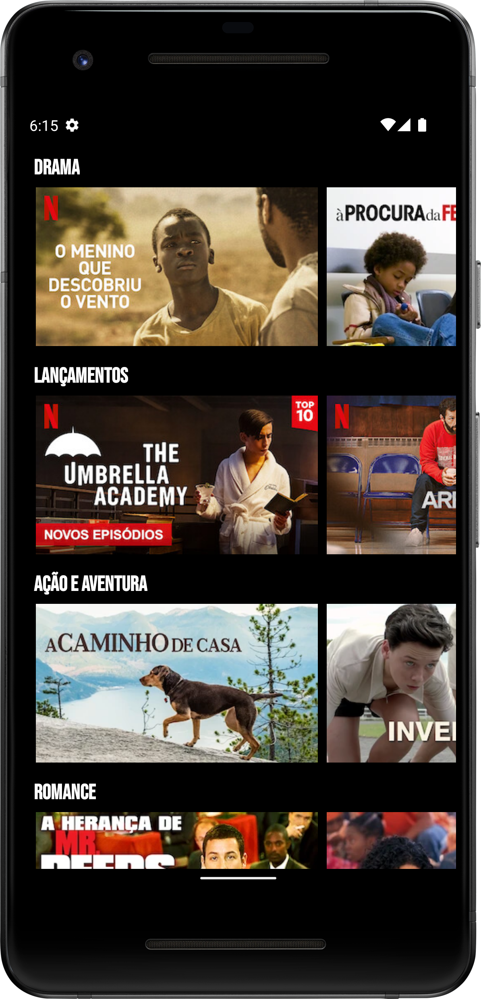

<h1 align="center">Aplicação Meuflix</h1>

Tabela de conteúdos
=================
<!--ts-->
   * [Fotos](#screenshots-camera)
   * [Sobre](#sobre-book)
   * [Tecnologias](#tecnologias-rocket)
   * [Features](#features-)
   * [Autor](#autor) 
<!--te-->

## Screenshots :camera: 
<h1 align="center">
  
  
  </h1>

## Sobre :book:
Aplicação cópia da Netflix feita com Kotlin e utilizando a arquitetura de projeto MVVM. 

## Tecnologias :rocket:

As seguintes ferramentas estão sendo utilizadas no desenvolvimento do projeto:

- [Kotlin](https://kotlinlang.org/)
- [Glide](https://github.com/bumptech/glide)
- [Retrofit](https://square.github.io/retrofit/)
- [OkHttpClient](https://square.github.io/okhttp/4.x/okhttp/okhttp3/-ok-http-client/)

## Features 🛠 

- [x] Requisição Web com Retrofit + OkHttpClient.
- [x] Detalhes dos filmes.
- [x] Arquitetura MVVM.

## Autor

Feito por André Esperança!

Contatos :
 

<a href="https://github.com/andreesperanca">
   
 
  
  <a href="https://github.com/andreesperanca" title="">André Esperança</a>

